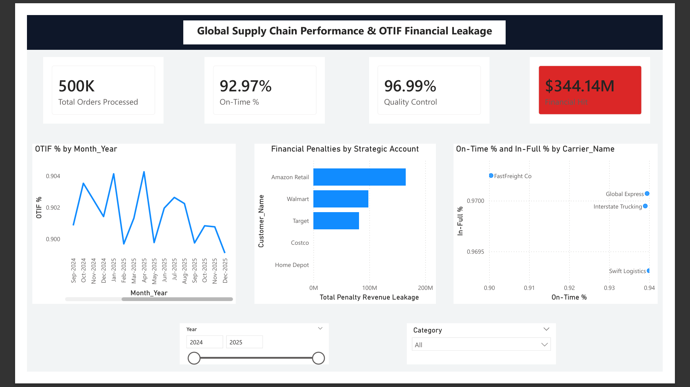

Enterprise Supply Chain OTIF & Financial Leakage Analytics Dashboard

📊 Business Scenario
A multinational consumer goods manufacturer faces severe financial compliance penalties due to missing strict On-Time In-Full (OTIF) delivery benchmarks set by tier-1 retail buyers (e.g., Walmart, Amazon, Target). When shipments arrive late or short-handed, retailers levy automatic chargebacks that directly erode company profit margins. 

This end-to-end business intelligence pipeline replaces manual spreadsheet tracking with an automated, relational data pipeline—equipping logistics managers and the CFO with immediate insight into financial leakage, contract compliance thresholds, and 3PL carrier bottlenecks.

⚙️ Modern Enterprise Tech Stack & Architecture
To simulate a real-world enterprise infrastructure, data flows through a distinct architectural pipeline rather than a flat file ingestion loop:
•	Data Generation: Python (Pandas, Faker) to generate a massive, high-velocity dataset containing over 500,000 shipment transactions across multiple calendar years with engineered data anomalies.
•	Relational Storage & Staging: PostgreSQL database server utilizing explicit Data Definition Language (DDL) schemas to enforce structural primary/foreign key data integrity at the data-source level.
•	Data Modeling: Power BI Desktop leveraging a highly optimized **Star Schema** relational design (1:Many single-direction paths) preventing complex bi-directional cross-filtering overhead.
•	Analytical Logic: Advanced Data Analysis Expressions (DAX) exploiting context-aware row-by-row iterators (`SUMX`) to evaluate complex, individualized customer penalty matrices.

---

 📐 Data Architecture (Star Schema Design)
The application architecture breaks down a flat transactional stream into a high-performance analytical schema:

 

---

🚀 Analytical Execution (The STAR Framework)

1. Situation
The manufacturing organization was suffering from millions of dollars in unmapped revenue leakage. Supply chain executives could see total penalties rising on the monthly income statement, but legacy Excel tools could not blend isolated order logs with individual customer contract thresholds. The operational root causes—whether stemming from poor warehouse quality control or specific bad carrier lanes—remained completely hidden.

2. Task
Design and implement an end-to-end cloud-ready business intelligence platform to:
1. Isolate the exact financial leakage (\$344.14M) and scale it dynamically over time.
2. Monitor individual vendor performance metrics against strict SLA baselines.
3. Construct an operational carrier matrix mapping delivery speed vs. item accuracy to flag underperforming logistics partners.

3. Action
•	Engineered Data Anomalies: Built a Python engine to synthesize data that maps real-world behaviour, such as engineering a targeted 25% shipping delay rate when FastFreight Co delivers to Walmart hubs.
•	Enforced Relational Integrity: Built the staging framework in PostgreSQL to filter out orphaned records and force uniform text formatting before Power BI ingestion.
•	Eliminated Date Hierarchies: Authored a dynamic DAX calculation table (Dim_Date) to force chronological sorting across years and quarters, avoiding Power BI's standard auto-date performance lags.
•	Developed Context-Aware Evaluation: Designed a robust multi-variable financial filter using SUMX and RELATEDTABLE to dynamically check if a customer’s live OTIF score dropped below their specific contract threshold before applying distinct penalty rates.

4. Result
•	Executive Visibility: Built an alert-driven executive dashboard tracking $344.14M in penalty leakage, changing the narrative from a defensive logistics dispute to high-priority business optimization.
•	Identified Systemic Bottlenecks: The Carrier Matrix Scatter Plot instantly exposed a major operational conflict: FastFreight Co maintains an exceptionally high quality/in-full rate (97%) but has a severely delayed On-Time delivery rate (90%).
•	Financial Safeguard: By shifting freight allocations away from underperforming carriers on late routes, the logistics group can proactively insulate enterprise contract compliance and recover millions in revenue leakage.

---

📂 Project Structure
•	generate_data.py: Custom Python data generation script utilizing Faker/Pandas.
•	database_setup.sql: Production-grade PostgreSQL script to create schema structures.
•	Supply_Chain_OTIF_Analytics.pbix: Completed Power BI model file with clean UI layouts.
