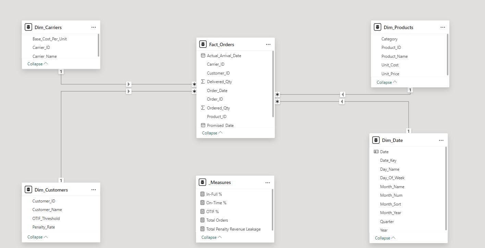

# Enterprise Real Estate Valuation & Investment Appraisal Engine

## 📊 Business Scenario
Asset valuation models in high-value retail, luxury commodities, and real estate often suffer from disjointed data silos and static pricing estimates. This end-to-end data analytics platform bridges that gap by replacing manual, traditional calculations with an automated, relational cloud-ready pipeline. 

By integrating multi-variable asset properties (neighborhood zoning, dimensions, and material quality grades), this system allows executives and investment appraisal directors to isolate valuation patterns and interactively simulate portfolio value fluctuations based on structural updates.

## 🛠️ Tech Stack & Pipeline Architecture
- **Data Engineering & Preprocessing:** Python (Built-in `csv` module) engineered inside VS Code to cleanly parse, impute missing geographic parameters, and feature-engineer pricing metrics natively without relying on heavy external data-frame libraries.
- **Relational Data Tier:** PostgreSQL server managing an enterprise-standard **Star Schema** architecture (Fact/Dimension configurations) with strict data integrity parameters.
- **Analytical Intelligence:** Power BI Desktop leveraging context-aware Data Analysis Expressions (DAX) and integrated numeric "What-If" parameter simulation engines.

---

## 📐 Data Architecture (Star Schema Design)
The application architecture breaks down a flat transactional stream into a high-performance analytical schema:

---

## 🚀 Analytical Execution (The STAR Framework)

### 1. Situation
Investment managers lacked centralized transparency into property values across fragmented regional zones, making it impossible to accurately forecast asset appreciation resulting from physical renovations.

### 2. Task
Build an end-to-end data pipeline to ingest messy property records, normalise the schemas into a structured relational server, and construct an interactive appraisal tool.

### 3. Action
* **Formulated Pure Python Extraction:** New data preparation layer created using native system libraries (`csv` module) to programmatically ingest transactional records, handle missing categorical string items via statistical modes, and calculate price-per-square-foot metrics.
* **Designed SQL ETL Staging Routine:** Developed a multi-tier dynamic staging table workflow inside a PostgreSQL database to bypass data type conflicts, enforce strict primary/foreign key relationships, and cast fields cleanly.
* **Programmed Advanced DAX Intelligence:** Programmed custom relational metrics tied directly to numerical parameters to allow users to slide through different capital expenditure and renovation return values interactively.

### 4. Result
* **Executive Visibility:** Delivered a production-ready dashboard featuring a high-impact Decomposition Tree asset drill-down and a color-coded quality matrix heat map tracking a global **$264.14M portfolio baseline**.
* **Identified Systemic Valuation Trends:** Built a multi-variable scatter plot that successfully isolated real estate valuation curves, giving appraisers and corporate decision-makers immediate clarity on property appreciation.
